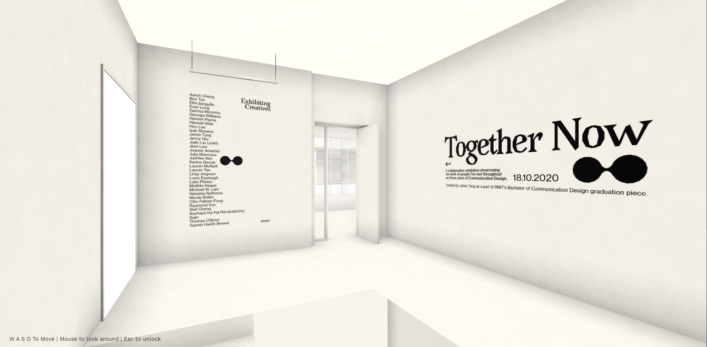

# TogetherNow

HI!

Due to social distancing, I think people have begun to realise how important it is to collaborate and try to stay connected. A simple environment filled with the presence of your friends or family can be a warm and pleasant feeling. 

Together Now is a virtual exhibition of 30 students who I have met throughout my 3 years of Communication Design. The concept is to create a space that we can all relate to and feel at home and together, despite the restrictions throughout 2020. 

The structure is a replication of our studio (building 9 level 3) where we have each spent countless hours learning and growing as a cohort. These memories created shouldn’t be shadowed by remote learning and so the purpose of the experience is to once again to bring forth a feeling of walking into building 9. Whether it be the awkward first day of class, making new friends, looking at others works in a pin-up session, or showing up late with bed hair. So let this space be a place to celebrate and ultimately, come together now. 

*seems to work best on chrome, safari FireFox / Desktop only
## Visit here: [🖼️](https://jamtt.github.io/TogetherNow/) 

